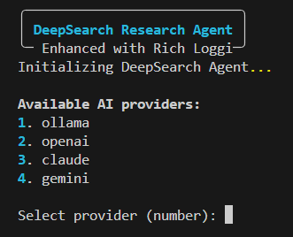
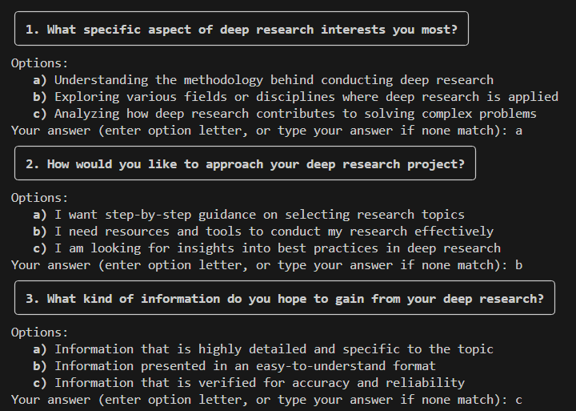

# Deep Research

This is a project for Deep Research, we use the duckduckgo as search engine, and the firecrawl as the content scraper.

## Features

- Topic-based research with AI-generated questions
- Interactive Q&A for focused searching
- Intelligent search term generation
- DuckDuckGo search integration
- AI-powered comprehensive report generation
- Support for multiple AI providers (Claude, OpenAI, Gemini, Ollama)

## Install

1. Clone the project

```sh
git clone https://github.com/yourusername/deep-research.git
cd deep-research
```

2. Setup the environment

```sh
conda create -n deep_research python==3.11.10 -y
conda activate deep_research
pip install -r requirements.txt
```

3. Configure API Keys

Create a `.env` file in the project root with your AI provider API keys

> ![NOTE]
> If you are going to use ollama, then this step is not needed

```env
CLAUDE_API_KEY=your_claude_api_key
OPENAI_API_KEY=your_openai_api_key
GEMINI_API_KEY=your_gemini_api_key
```

## Usage

1. Basic Usage

```sh
python src/search.py
```

2. Follow the interactive prompts:
   - Enter your research topic
   - Answer the AI-generated questions
   - Answer the breadth and depth of the search
   - Wait for the search and report generation
   - Review the comprehensive report





## Project Structure

```bash
deep-research/
├── LICENSE
├── README.md
├── .env
├── .gitignore
├── images
│   ├── model_select.png
│   └── questions.png
├── requirements.txt
├── results
└── src
    ├── ai_provider
    │   ├── ai_provider.py
    │   └── ollama_test.py
    ├── search.py
    └── search_engine
        ├── bing_search.py
        ├── duckduckgo_search.py
        └── search_test.py
```

## AI Provider Support

The system supports multiple AI providers:

1. Claude (Default)
   - Models: claude-3-opus, claude-3-sonnet, claude-3-haiku
   - Requires: CLAUDE_API_KEY

2. OpenAI
   - Models: gpt-3.5-turbo, gpt-4
   - Requires: OPENAI_API_KEY

3. Gemini
   - Models: gemini-pro
   - Requires: GEMINI_API_KEY

4. Ollama (Local)
   - Models: Based on local installation
   - No API key required

## Customization

You can customize the search behavior by modifying these parameters in `src/search.py`:

- Number of questions generated
- Search result limits
- AI provider and model selection
- Report format and structure

## Contributing

1. Fork the repository
2. Create your feature branch (`git checkout -b feature/amazing-feature`)
3. Commit your changes (`git commit -m 'Add amazing feature'`)
4. Push to the branch (`git push origin feature/amazing-feature`)
5. Open a Pull Request

## License

This project is licensed under the MIT License - see the LICENSE file for details.
